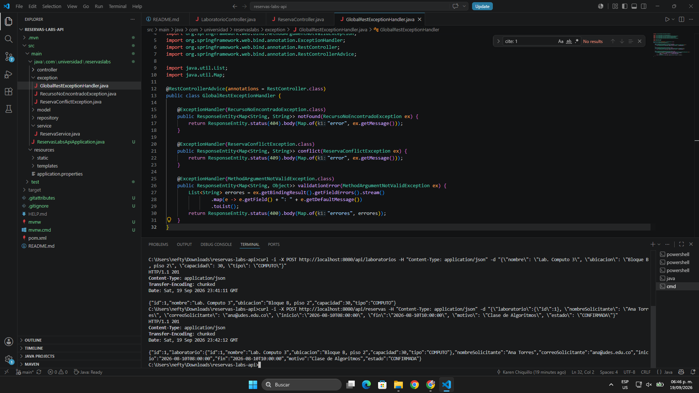
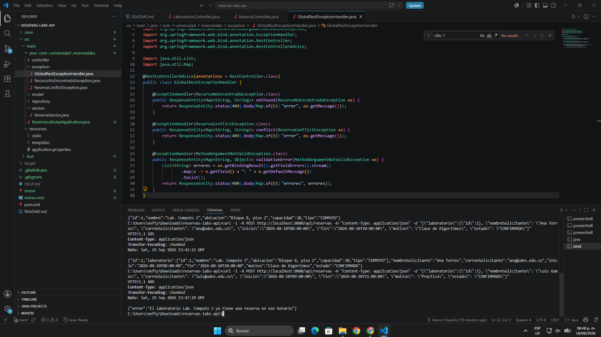
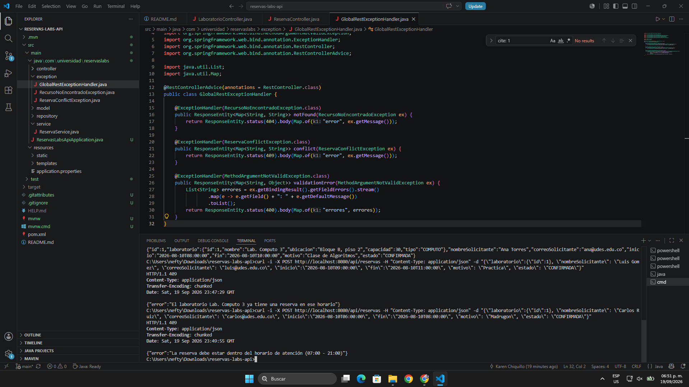
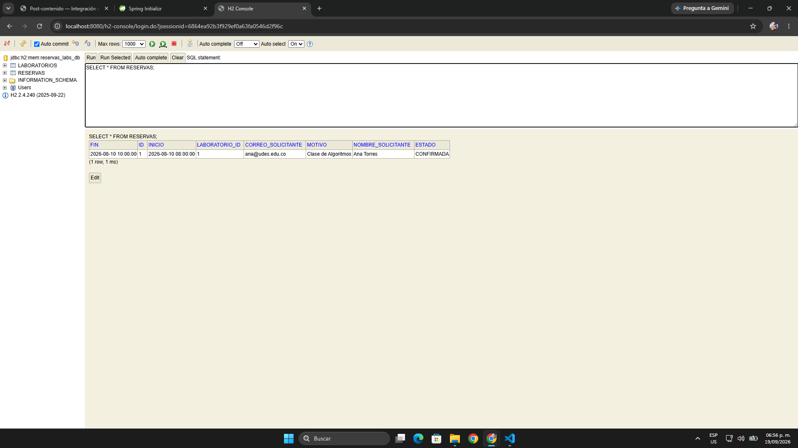
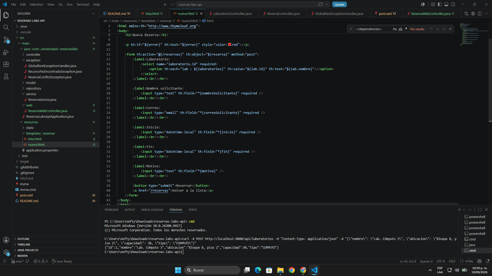
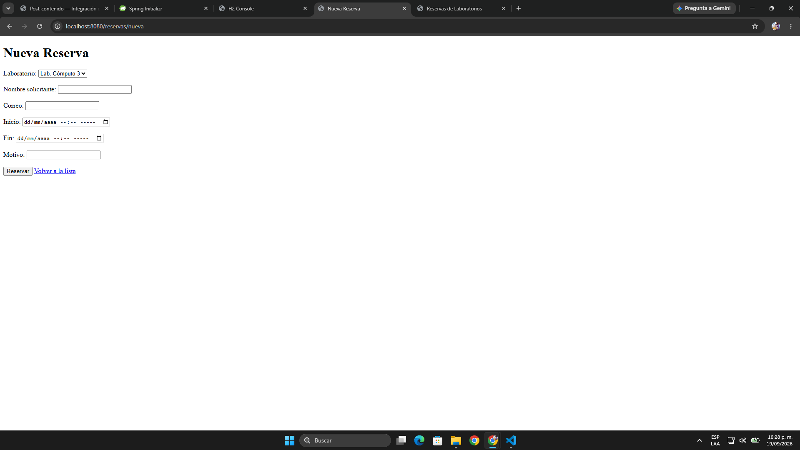
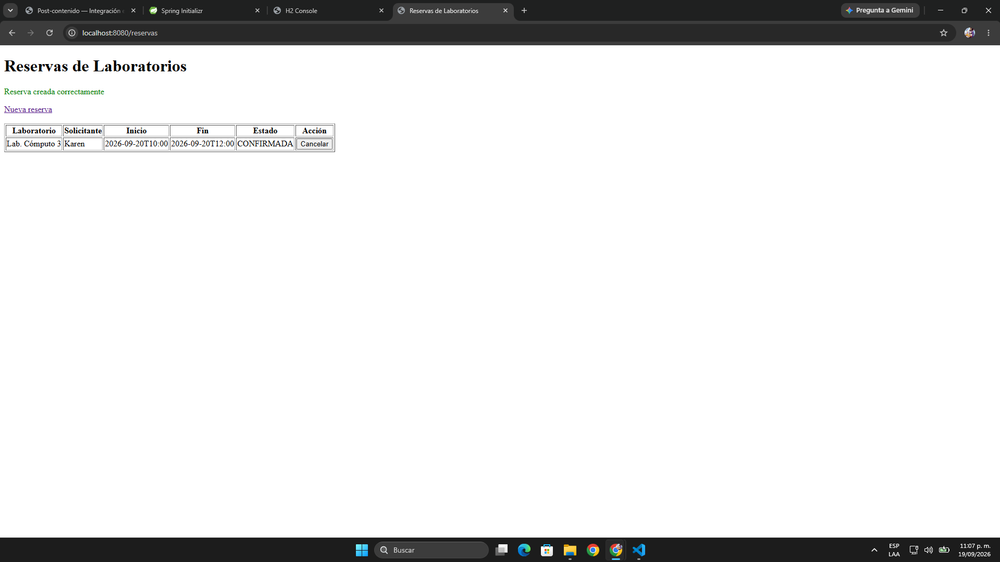
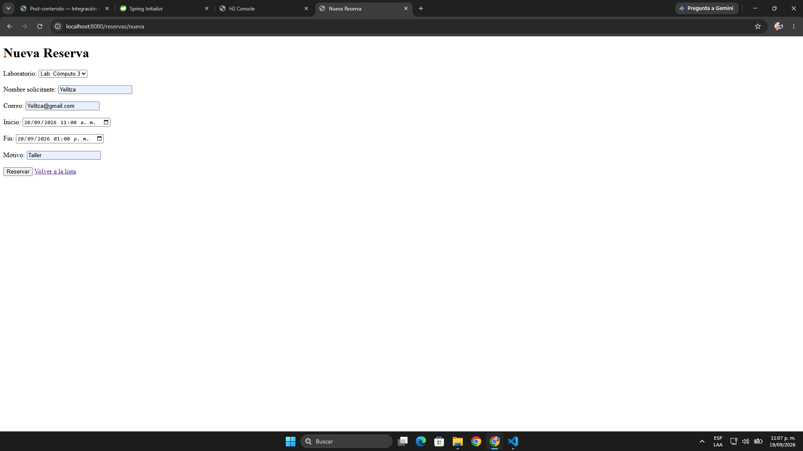
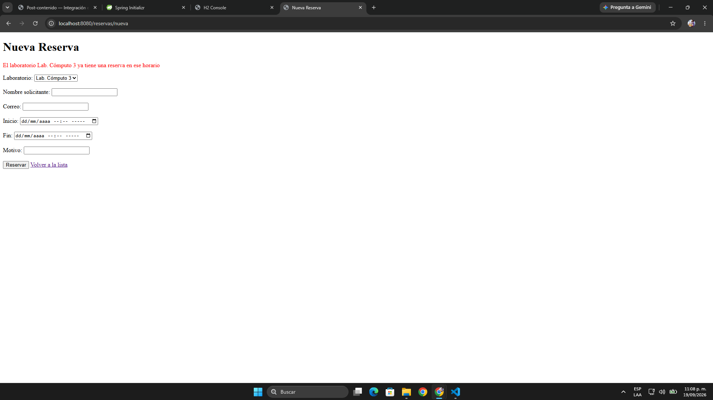

# Post-contenido — Unidad 5: Integración en Aplicaciones Web
## Sistema de Reserva de Laboratorios

## Descripción
Repositorio del post-contenido de la Unidad 5 de Patrones de Diseño de Software. Un único proyecto Spring Boot (`reservas-labs-api`) para la reserva de laboratorios de cómputo, con dos partes: una API REST en capas (Entity, Repository, Service, Controller) sobre H2, y una vista Thymeleaf (MVC clásico) que reutiliza el mismo Service.

## Parte 1 — Repository, Service y Controller REST
LaboratorioRepository y ReservaRepository extienden JpaRepository; ReservaRepository agrega una consulta JPQL propia para detectar solapamientos de horario. ReservaService concentra las reglas de negocio (solapamiento, horario de atención, duración, cancelación tardía). ReservaController y LaboratorioController exponen `/api/reservas` y `/api/laboratorios`. Ver paquetes `model/`, `repository/`, `service/`, `exception/` y `controller/`.

## Parte 2 — Vista MVC con Thymeleaf
ReservaWebController expone `/reservas` con Thymeleaf, inyectando la MISMA instancia de ReservaService que usa la API REST — sin Service duplicado. ReservaWebExceptionHandler maneja las mismas excepciones de dominio que GlobalRestExceptionHandler, con presentación distinta (redirección con mensaje en vez de JSON). Ver paquete `web/` y `templates/reservas/`.

## Cómo ejecutar
```bash
$ mvn clean package
$ mvn spring-boot:run
```

- **API REST:** http://localhost:8080/api/reservas
- **Vista MVC:** http://localhost:8080/reservas
- **Consola H2:** http://localhost:8080/h2-console  
  - *JDBC URL:* `jdbc:h2:mem:reservas_labs_db`  
  - *Usuario:* `sa` | *Contraseña:* (vacía)

## Decisiones de diseño

### Punto de decisión 1 — Ubicación de la validación de solapamiento
El dilema de diseño consistió en determinar si la validación de solapamiento de horarios debía procesarse por completo en la capa Service, extrayendo todas las reservas del laboratorio a memoria RAM para evaluarlas mediante Java puro, o si debía fundamentarse en una consulta específica del Repository que realice el filtrado en el motor de base de datos. La alternativa de filtrar en memoria se descartó categóricamente debido a que, a medida que el historial de reservas crece en producción, transferir tablas masivas por la red e instanciar colecciones enteras degrada el rendimiento de forma crítica y genera un cuello de botella innecesario.

Por este motivo, se adoptó una solución colaborativa entre capas. La interfaz `ReservaRepository` resuelve de manera eficiente la consulta JPQL `buscarSolapamientos`, delegando el filtrado temporal al motor SQL mediante índices relacionales. Sin embargo, el Repository se limita exclusivamente a responder la pregunta de acceso a datos sobre qué registros colisionan en ese rango horario. La decisión final de negocio (evaluar si la lista resultante contiene elementos y detonar la excepción `ReservaConflictException` con un mensaje institucional claro) reside de manera exclusiva en `ReservaService`.

Si la capa de presentación o los controladores llamaran directamente a la consulta `buscarSolapamientos()` del Repository eludiendo al Service, se rompería el principio de separación de preocupaciones. En dicho escenario adverso, el controlador quedaría fuertemente acoplado a la infraestructura de persistencia y asumiría lógica de dominio que no le corresponde, lo cual impediría reutilizar la validación en otras interfaces cliente y obligaría a replicar las comprobaciones de estado manualmente.

### Punto de decisión 2 — Reglas con y sin apoyo del Repository
El segundo dilema radicó en establecer el límite arquitectónico entre las reglas de dominio que exigen conectarse a la base de datos y aquellas que deben resolverse de forma autónoma dentro del Service. El criterio rector adoptado determina que una regla de negocio requiere el apoyo del Repository únicamente cuando su comprobación depende del estado histórico o concurrente de otras entidades del sistema, como sucede con la detección de solapamientos entre solicitudes ajenas.

Por el contrario, la validación del horario de atención de la universidad (entre las 07:00 y las 21:00) y de la duración permitida por sesión (mínimo 30 minutos y máximo 3 horas) depende exclusivamente de los atributos propios de la reserva que se pretende crear. Debido a que estos datos vienen dados en el objeto entrante, la verificación se encapsuló en el método privado `validarHorarioYDuracion` dentro de `ReservaService`, operando con las clases estándar `Duration` y `LocalTime` de Java puro.

Ejecutar esta verificación en memoria antes de cualquier interacción con la base de datos evita llamadas de entrada y salida (I/O) superfluas, rechaza de forma inmediata solicitudes con parámetros inconsistentes y reduce la latencia global del sistema, asegurando que el acceso a datos solo se efectúe cuando la entidad satisface todas sus invariantes intrínsecas.

### Nota sobre LaboratorioController
Dentro de la arquitectura implementada, la clase `LaboratorioController` constituye la única excepción intencional a la directriz de diseño que establece que un controlador nunca debe acceder directamente al repositorio. El catálogo de laboratorios opera como una administración básica de consulta y registro que carece de invariantes de negocio o validaciones de dominio complejas.

Bajo estas condiciones, introducir una clase intermedia como `LaboratorioService` cuyos métodos únicamente delegaran llamadas hacia `LaboratorioRepository` incurriría de forma directa en el antipatrón de Service anémico. Dicho antipatrón incrementa la complejidad accidental del proyecto y genera código redundante sin aportar valor funcional. Por lo tanto, la capa de servicio se incorpora exclusivamente cuando existe lógica de negocio sustancial que justifique su presencia, como sucede en `ReservaService`, evitando seguir esquemas de capas de manera dogmática o puramente mecánica.

### Punto de decisión 3 — Cómo comparten Service el Controller MVC y el REST
El tercer dilema arquitectónico planteó cómo permitir que la interfaz web tradicional (`ReservaWebController`) y los endpoints de la API (`ReservaController`) ejecuten exactamente las mismas validaciones de negocio (solapamiento de horarios, horario de apertura/cierre de 07:00 a 21:00 y duración de 30 minutos a 3 horas) sin duplicar código ni generar inconsistencias operativas.

La solución adoptada consiste en inyectar por constructor la misma clase `ReservaService` en ambos controladores, gestionada por el contenedor de inversión de control (IoC) de Spring como un único bean singleton:
- En `ReservaController` (REST), el servicio se inyecta en su constructor y se asigna al campo `private final ReservaService service;`.
- En `ReservaWebController` (MVC), se declara de forma idéntica el campo `private final ReservaService service;` y se recibe la misma instancia a través de su constructor.

Al momento de procesar una creación, `ReservaWebController` invoca directamente `service.crear(reserva)` en su método `@PostMapping`. De este modo, la vista web se somete a las mismas comprobaciones de dominio que la API REST sin añadir una sola línea de validación redundante en la capa de presentación.

Se descartaron categóricamente dos alternativas:
1. **Replicar la lógica de validación dentro de `ReservaWebController`:** Esta opción viola el principio de responsabilidad única (SRP) y el principio DRY (*Don't Repeat Yourself*). Si en el futuro las políticas institucionales cambian, sería obligatorio actualizar el código en dos lugares distintos, con el riesgo latente de desincronizar la API frente a la interfaz web.
2. **Crear un servicio paralelo como `ReservaWebService`:** Introducir un servicio duplicado con implementaciones casi calcadas aumentaría la deuda técnica y la complejidad accidental del proyecto sin aportar ningún beneficio arquitectónico.

### Punto de decisión 4 — Manejo de errores consistente entre MVC y REST
El cuarto dilema de diseño consistió en definir si los errores de la aplicación web tradicional (`ReservaWebController`) debían capturarse dentro de un único `@RestControllerAdvice` global junto con las excepciones de la API REST, o si convenía implementar un manejador especializado independiente.

Se adoptó la estrategia de desacoplar los manejadores según la superficie de presentación:
- `GlobalRestExceptionHandler` está anotado con `@RestControllerAdvice(annotations = RestController.class)`, limitando su alcance exclusivamente a los controladores REST para responder estructuras JSON serializadas y códigos de estado semánticos (409, 404, 400).
- `ReservaWebExceptionHandler` está anotado con `@ControllerAdvice(assignableTypes = ReservaWebController.class)`, restringiendo su captura a la capa web para procesar redirecciones HTTP (`redirect:/reservas/nueva`) e inyectar el mensaje del fallo como un atributo flash (`redirect.addFlashAttribute("error", ex.getMessage())`) legible en la plantilla Thymeleaf.

Esta decisión garantiza una coherencia de dominio total: ambas superficies consumen el mismo vocabulario de excepciones (`ReservaConflictException` y `RecursoNoEncontradoException`) emitidas por `ReservaService`, pero cada una adapta la presentación según el canal de consumo.

La alternativa descartada —unificar ambos comportamientos en una sola clase interceptora mediante condicionales que inspeccionaran cabeceras HTTP como `Accept`— fue rechazada debido a que incrementa innecesariamente la complejidad ciclomática del manejador, mezcla la lógica de vistas HTML con la serialización JSON y vulnera el principio de responsabilidad única (SRP).

## Evidencias de Ejecución (Capturas de Pantalla)

### Parte 1: Endpoints REST y Persistencia en H2
- **Creación de Reserva Exitosa (HTTP 201):**  
  

- **Conflicto de Solapamiento Detectado (HTTP 409):**  
  

- **Rechazo por Horario de Atención Fuera de Rango:**  
  

- **Registros Almacenados en Consola H2:**  
  

### Parte 2: Vistas Web MVC (Thymeleaf)
- **Registro de Laboratorio en Catálogo (POST /api/laboratorios):**  
  

- **Carga de Catálogo en Formulario (`/reservas/nueva`):**  
  

- **Reserva Creada Exitosamente en Vista Web (`/reservas`):**  
  

- **Intento de Reserva en Horario Solapado:**  
  

- **Mensaje de Error por Solapamiento en Thymeleaf (Mismo mensaje que API REST):**  
  

## Herramientas utilizadas
- Java 17, Spring Boot 3.2, Spring Data JPA, H2, Thymeleaf
- Apache Maven, Postman/curl, Git, GitHub

## Conclusiones
El desarrollo de este laboratorio permitió comprender la importancia de una arquitectura en capas desacoplada para evitar el acoplamiento entre la infraestructura de datos y la lógica de negocio. El mayor desafío técnico consistió en determinar la frontera exacta entre el Repository y el Service, distinguiendo cuándo una validación exige el poder de filtrado del motor de base de datos (solapamiento temporal) y cuándo debe ejecutarse estrictamente en memoria (horario institucional y duración). La incorporación de Thymeleaf demostró que un Service bien diseñado actúa como núcleo reutilizable sin importar si el consumidor final es un cliente REST que espera JSON o un controlador web que produce HTML. Finalmente, la implementación de manejadores de excepciones separados evidenció cómo mantener un vocabulario de dominio unificado ofreciendo respuestas adaptadas a cada canal.